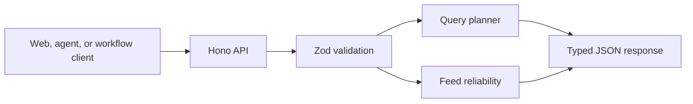

# Sports Intelligence API PRD

## Product

A typed HTTP boundary for sports intelligence orchestration and reliability
controls.

## Problem

Platform logic is difficult to reuse when every product embeds query planning,
validation, and feed policy directly in its frontend or workflow.

## Goals

- Expose stable versioned API contracts.
- Validate every payload with Zod.
- Route known analyst questions and fall back to human review.
- Block unreliable feed batches before downstream processing.

## Architecture

