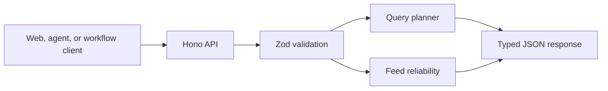

# Sports Intelligence API PRD

## Product

A small typed HTTP boundary for experimenting with deterministic sports query
routing and feed-quality policy.

## Problem

Platform logic is difficult to reuse when every product embeds query planning,
validation, and feed policy directly in its frontend or workflow.

## Goals

- Expose stable versioned API contracts.
- Validate every payload with Zod.
- Score known analyst question families and fall back to human review for ties
  or unsupported questions.
- Block unreliable feed batches before downstream processing.

## Non-goals

- Fetching or storing sports data.
- Executing the named tools in a query plan.
- Generating analyst answers.
- Authentication, multi-tenancy, or production observability.

## Architecture

